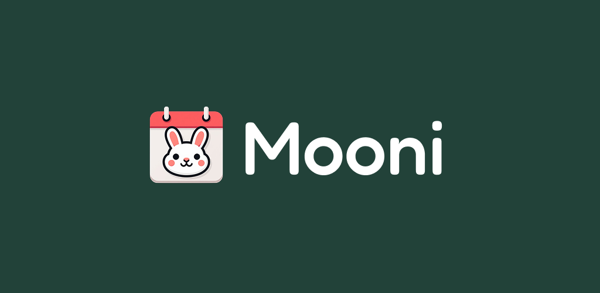

### Your Cycle, Your Privacy.

Tracking your period shouldn't be complicated or invasive. **Mooni** is designed for those who want a reliable, beautiful, and strictly private way to stay in tune with their body. No fluff, no ads selling your data—just you and your cycle.

---

### Why Mooni? 🌼

We focus on what truly matters. We've stripped away the noise (no forums, no shopping, no blogs) to give you a seamless experience.

- **🔒 Pure Privacy:** We don't collect or sell your data. Everything is stored safely on your device.
- **✨ Clean & Minimal:** Enjoy a premium UI/UX that’s easy on the eyes and a joy to use.
- **💸 100% Free:** No monthly subscriptions or hidden paywalls. All features are available to everyone.

---

### Key Features 🛠️

#### **1. Intuitive Calendar View** 📅

Get a bird's-eye view of your past and future cycles. Easily track your **period, ovulation, and fertile windows** at a glance.

#### **2. Detailed Daily Logs** 📝

Quickly record important details (like sexual activity, medication, pain and simple personal notes) on your calendar:

#### **3. Smart Predictions & Alerts** 🔔

Never be caught off guard. Mooni provides accurate D-day countdowns and helpful notifications for your next period or fertile window.

#### **4. Secure App Lock** 🔐

Your data is sensitive. Protect your logs with both **PIN** and **Biometric (Fingerprint)** authentication.

#### **5. Insightful Reports** 📊

Understand your body's trends with visual charts. We provide 6-month average reports & chart view to help you track changes over time.

#### **6. Safe Backup & Restore** 💾

Easily back up your data and restore it whenever you switch devices, keeping your history safe.

---

### What Users Love 💖

> "Finally, a period tracker that doesn't feel like a social media app.  
> It's fast, private, and looks amazing!"

---

**Download Mooni now and experience the simplest way to track your cycle.**
